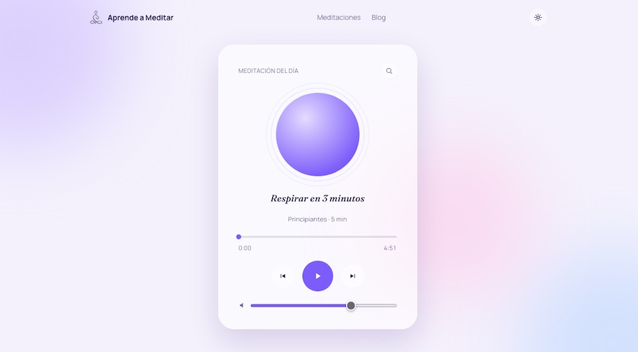

<div align="center">

# Aprende a Meditar

**Meditaciones guiadas en español para quienes están comenzando en este camino**

[](https://aprendeameditar.cl)

[**aprendeameditar.cl**](https://aprendeameditar.cl)

</div>

---

## Qué es

Aplicación web para descubrir y escuchar meditaciones guiadas, con un blog que atrae tráfico orgánico. El inicio abre directamente un reproductor con la **meditación del día**, para que alguien que llega por primera vez pueda darle play en segundos.

## Qué incluye

- **Reproductor completo** con orbe animado, progreso, volumen y anterior/siguiente.
- **Meditación del día**, rotación determinista por fecha calculada en el cliente.
- **Buscador y filtros por categoría** (sueño, ansiedad, estrés, respiración, principiantes).
- **Blog en Markdown** con Content Collections.
- **Tema claro y oscuro** con diseño glassmorfismo.
- **Sitio 100% estático**: rápido, barato de alojar y amigable con el SEO.

## Stack

| Capa | Tecnología |
|---|---|
| Framework | [Astro 7](https://astro.build), salida estática |
| Interactividad | React, solo en islas (reproductor y filtros) |
| Estilos | Tailwind CSS, con tokens de diseño en `global.css` |
| Contenido | Content Collections (Markdown) |
| Despliegue | GitHub Pages, con Cloudflare para el DNS |

## Primeros pasos

Requisitos: **Node.js 22.12 o superior** y npm.

```bash
git clone https://github.com/german-rs/aprendeameditar.git
cd aprendeameditar
npm install
npm run dev
```

El sitio queda disponible en `http://localhost:4321`.

### Comandos

| Comando | Acción |
|---|---|
| `npm install` | Instala dependencias |
| `npm run dev` | Servidor de desarrollo en `localhost:4321` |
| `npm run build` | Genera el sitio estático en `./dist/` |
| `npm run preview` | Previsualiza el build de producción |
| `npm run astro ...` | Ejecuta comandos del CLI de Astro |

## Agregar una meditación

1. Sube el audio a `public/audio/meditaciones/` (MP3).
2. Crea un archivo `.md` en `src/content/meditaciones/`:

```md
---
title: "Respirar en 3 minutos"
description: "Una pausa corta para volver al presente."
category: "Principiantes"
audioSrc: "/audio/meditaciones/respirar-en-3-minutos.mp3"
duration: 3 # minutos
publishDate: 2026-10-01
---
```

Todas las meditaciones entran en la rotación de la meditación del día. El detalle de los campos está en el [modelo de contenido](./docs/modelo-contenido.md).

## Estructura del proyecto

Detalle completo en [docs/arquitectura.md](./docs/arquitectura.md).

```
├── public/
│   ├── audio/meditaciones/    # audios (mp3)
│   └── images/
├── src/
│   ├── components/
│   │   ├── react/             # islas interactivas (reproductor, filtros)
│   │   └── astro/             # componentes estáticos
│   ├── content/               # Markdown: meditaciones y blog
│   ├── content.config.ts      # schemas de las colecciones
│   ├── layouts/
│   ├── pages/
│   └── styles/                # global.css (Tailwind y tokens)
├── docs/                      # documentación del proyecto
└── astro.config.mjs
```

## Documentación

| Documento | Contenido |
|---|---|
| [Arquitectura](./docs/arquitectura.md) | Stack, estructura de carpetas y decisiones técnicas |
| [Modelo de contenido](./docs/modelo-contenido.md) | Cómo se estructuran meditaciones y posts |
| [Guía de estilo del reproductor](./docs/guia-estilo-reproductor.md) | Tokens de color y tipografía, glassmorfismo |
| [Marca](./docs/brand.md) | Misión, voz y tono, identidad visual |
| [Despliegue](./docs/despliegue.md) | GitHub Pages, Cloudflare DNS y CI/CD |
| [Roadmap](./docs/roadmap.md) | Fases del proyecto |
| [Contribuir](./CONTRIBUTING.md) | Cómo agregar contenido y flujo de trabajo |

## Estado del proyecto

🟡 **Fase inicial.** Consulta el [roadmap](./docs/roadmap.md) para ver qué viene.

## Licencia

Por definir.